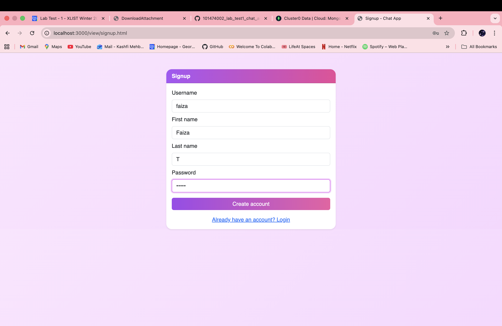
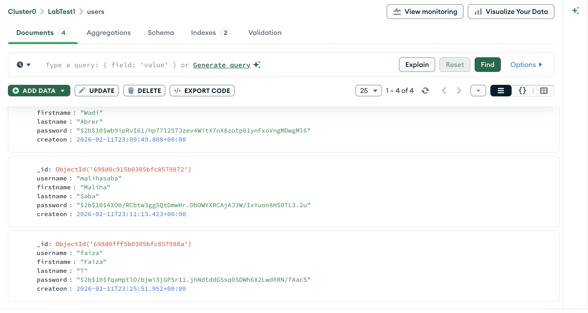
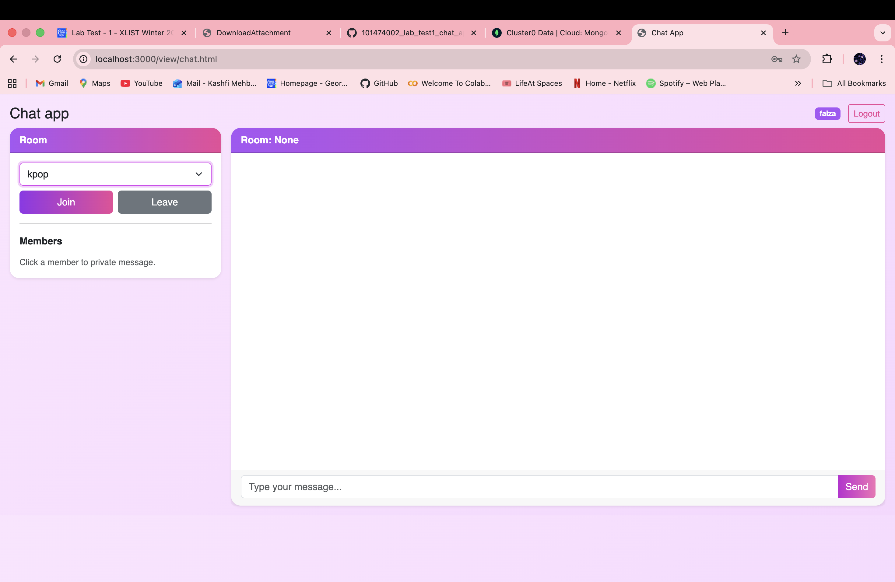
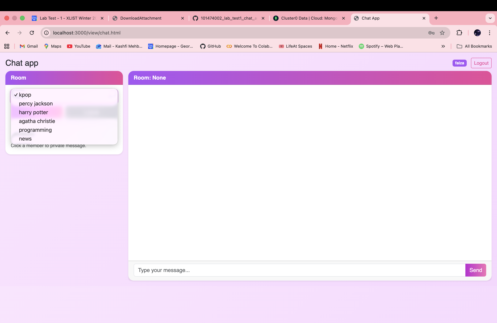
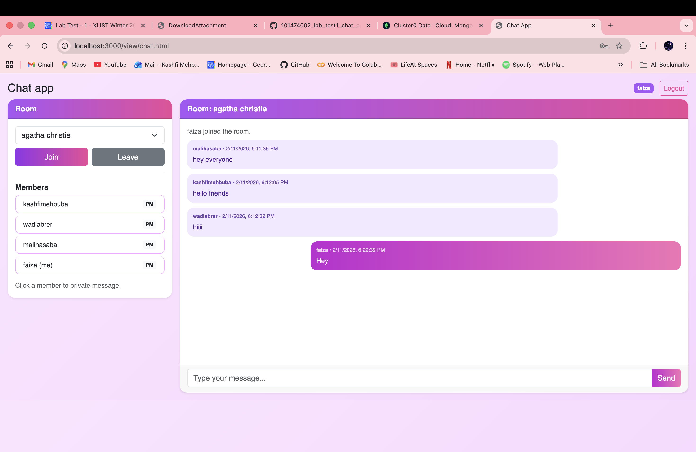
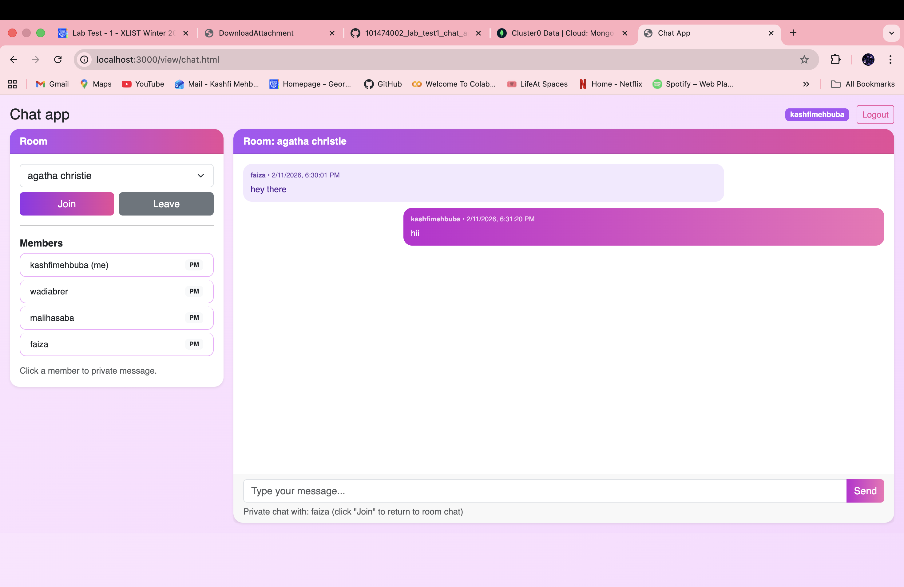
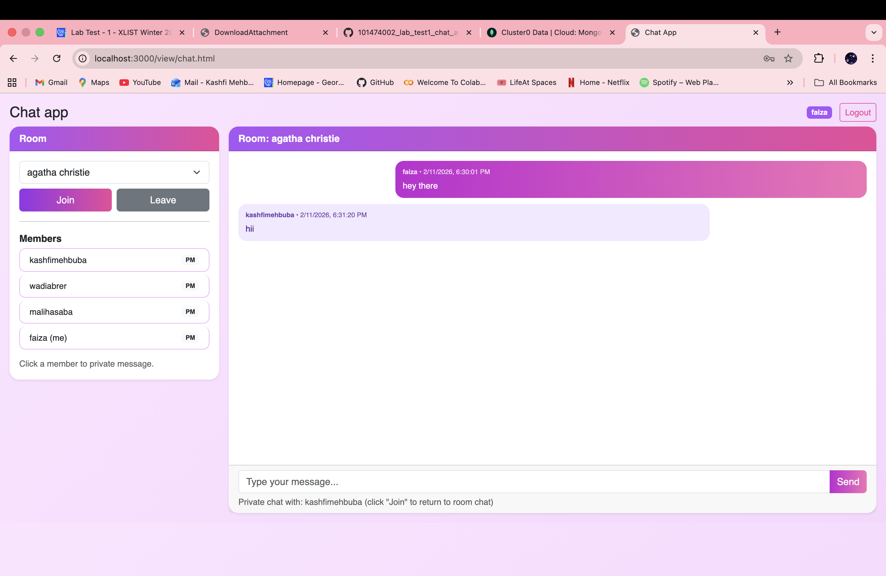
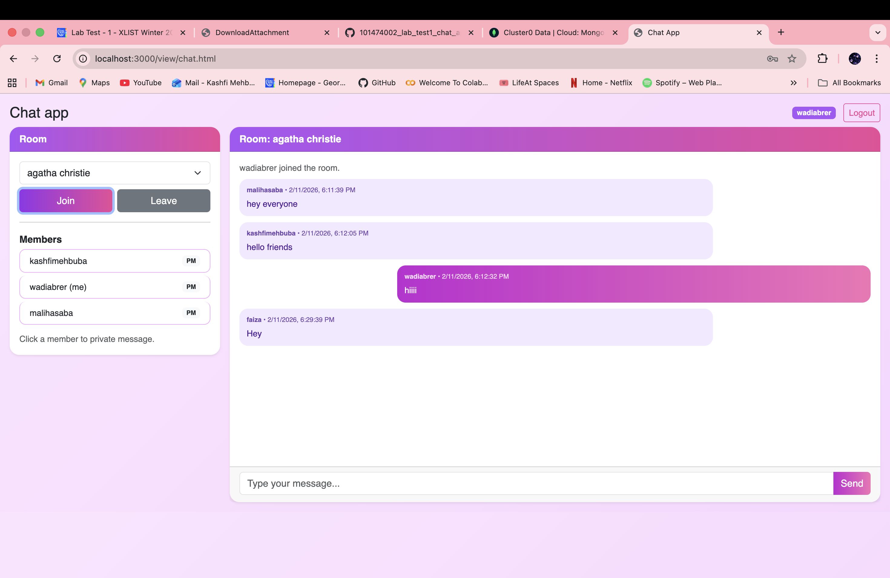
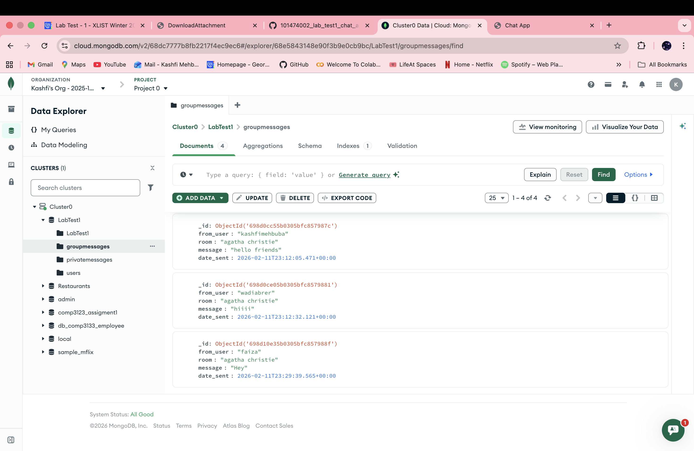

# Comp3133 Lab Test 01

## Name: Kashfi Mehbuba
## Student ID: 101474002

**Log In using new user credentials**

 

**Sign Up user using existing credentials**
 
 

**Sign Up user using new credentials**
 

**New User ‘faiza’ has been created**
 

**Interface**
  
  

**User ‘faiza’ joins chatroom “agatha chritie” and sends a message (You can see list of participants who joined the room)**

 
 

**User ‘faiza’ and ‘kashfimehbuba’ private message (from both ends)**
 
  
  

**User ‘faiza’ leaves chatroom “agatha christie”**
  

**User ‘faiza’ no longer in the list of participants**
 
 

**Private messages and Group messages saved in MongoDB Atlas**
  
 
 

  
